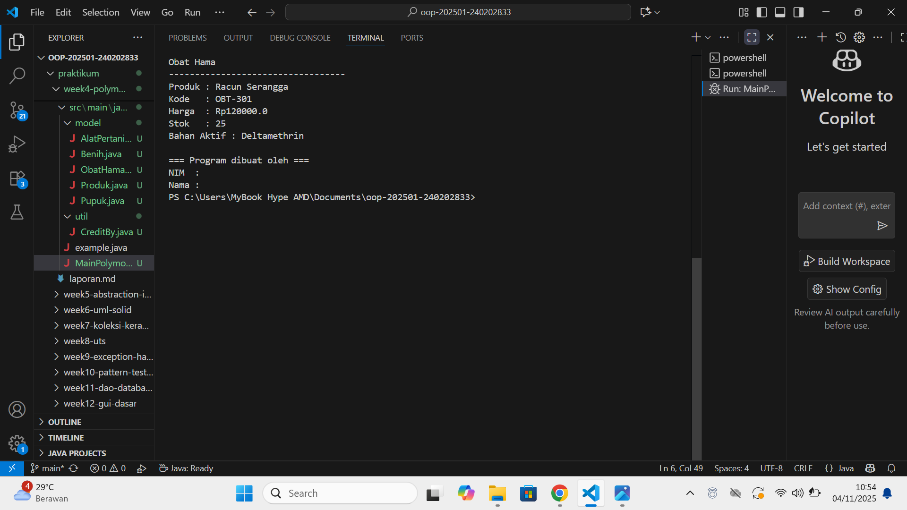

# Laporan Praktikum Minggu 4 
Topik: Polymorphism (Info Produk)

## Identitas
- Nama  : Egalian Lalintang
- NIM   : 240202833
- Kelas : 3IKRA

---

## Tujuan
Mahasiswa mampu menjelaskan konsep polymorphism dalam OOP.
Mahasiswa mampu membedakan method overloading dan overriding.
Mahasiswa mampu mengimplementasikan polymorphism (overriding, overloading, dynamic binding) dalam program.
Mahasiswa mampu menganalisis contoh kasus polymorphism pada sistem nyata (Agri-POS).

---

## Dasar Teori
Polymorphism berarti “banyak bentuk” dan memungkinkan objek yang berbeda merespons panggilan method yang sama dengan cara yang berbeda.

Overloading → mendefinisikan method dengan nama sama tetapi parameter berbeda.
Overriding → subclass mengganti implementasi method dari superclass.
Dynamic Binding → pemanggilan method ditentukan saat runtime, bukan compile time.
Dalam konteks Agri-POS, misalnya:

Method getInfo() pada Produk dioverride oleh Benih, Pupuk, AlatPertanian untuk menampilkan detail spesifik.
Method tambahStok() bisa dibuat overload dengan parameter berbeda (int, double).

---

## Langkah Praktikum
1. Overloading
Tambahkan method tambahStok(int jumlah) dan tambahStok(double jumlah) pada class Produk.
2. Overriding
Tambahkan method getInfo() pada superclass Produk.
Override method getInfo() pada subclass Benih, Pupuk, dan AlatPertanian.
3. Dynamic Binding
Buat array Produk[] daftarProduk yang berisi objek Benih, Pupuk, dan AlatPertanian.
Loop array tersebut dan panggil getInfo(). Perhatikan bagaimana Java memanggil method sesuai jenis objek aktual.
4. Main Class
Buat MainPolymorphism.java untuk mendemonstrasikan overloading, overriding, dan dynamic binding.
5. CreditBy
Tetap panggil CreditBy.print("<NIM>", "<Nama>").
6. Commit dan Push
Commit dengan pesan: week4-polymorphism.
---

## Kode Program
AlatPertanian.java

package main.java.com.upb.agripos.model;

public class AlatPertanian extends Produk {
    private String bahan;

    public AlatPertanian(String kode, String nama, double harga, int stok, String bahan) {
        super(kode, nama, harga, stok);
        this.bahan = bahan;
    }

    @Override
    public String getInfo() {
        return "Alat Pertanian\n----------------------------------\n"
             + "Produk : " + getNama() + "\n"
             + "Kode   : " + getKode() + "\n"
             + "Harga  : Rp" + getHarga() + "\n"
             + "Stok   : " + getStok() + "\n"
             + "Bahan  : " + bahan + "\n";
    }}

Benih.java

    package main.java.com.upb.agripos.model;

public class Benih extends Produk {
    private String varietas;

    public Benih(String kode, String nama, double harga, int stok, String varietas) {
        super(kode, nama, harga, stok);
        this.varietas = varietas;
    }

    @Override
    public String getInfo() {
        return "Benih\n----------------------------------\n"
             + "Produk : " + getNama() + "\n"
             + "Kode   : " + getKode() + "\n"
             + "Harga  : Rp" + getHarga() + "\n"
             + "Stok   : " + getStok() + "\n"
             + "Varietas : " + varietas + "\n";
    }
}

ObatHama.java

package main.java.com.upb.agripos.model;

public class ObatHama extends Produk {
    private String bahanAktif;

    public ObatHama(String kode, String nama, double harga, int stok, String bahanAktif) {
        super(kode, nama, harga, stok);
        this.bahanAktif = bahanAktif;
    }

    @Override
    public String getInfo() {
        return "Obat Hama\n----------------------------------\n"
             + "Produk : " + getNama() + "\n"
             + "Kode   : " + getKode() + "\n"
             + "Harga  : Rp" + getHarga() + "\n"
             + "Stok   : " + getStok() + "\n"
             + "Bahan Aktif : " + bahanAktif + "\n";
    }
}

Produk.java

package main.java.com.upb.agripos.model;

public class Produk {
    private String kode;
    private String nama;
    private double harga;
    private int stok;

    public Produk(String kode, String nama, double harga, int stok) {
        this.kode = kode;
        this.nama = nama;
        this.harga = harga;
        this.stok = stok;
    }

    // Overloading
    public void tambahStok(int jumlah) {
        stok += jumlah;
        System.out.println("Stok bertambah sebanyak " + jumlah + " unit (int).");
    }

    public void tambahStok(double jumlah) {
        stok += (int) jumlah;
        System.out.println("Stok bertambah sebanyak " + jumlah + " unit (double).");
    }

    // Getters
    public String getKode() { return kode; }
    public String getNama() { return nama; }
    public double getHarga() { return harga; }
    public int getStok() { return stok; }

    // Default info
    public String getInfo() {
        return "Produk: " + nama + " (Kode: " + kode + ")";
    }
}

Pupuk.java

package main.java.com.upb.agripos.model;

public class Pupuk extends Produk {
    private String jenis;

    public Pupuk(String kode, String nama, double harga, int stok, String jenis) {
        super(kode, nama, harga, stok);
        this.jenis = jenis;
    }

    @Override
    public String getInfo() {
        return "Pupuk\n----------------------------------\n"
             + "Produk : " + getNama() + "\n"
             + "Kode   : " + getKode() + "\n"
             + "Harga  : Rp" + getHarga() + "\n"
             + "Stok   : " + getStok() + "\n"
             + "Jenis  : " + jenis + "\n";
    }
}

---

## Hasil Eksekusi  

---

## Analisis
1. Percobaan ini berhasil menunjukkan tiga bentuk Polymorphism:
Overloading (Statis): Diterapkan pada method tambahStok() yang memiliki dua versi berbeda (int dan double), di mana keputusan pemanggilan method terjadi saat kompilasi.
Overriding & Dynamic Binding (Dinamis): Diterapkan pada method getInfo(). Array referensi superclass (Produk[]) menampung berbagai objek subclass. Keputusan method mana yang dieksekusi terjadi saat runtime (eksekusi), menghasilkan output spesifik sesuai objek aslinya (ObatHama, Benih, dll.).

2. Perbedaan Kunci 
Pendekatan minggu ini bergeser dari fokus struktur pewarisan (minggu lalu) menjadi fokus perilaku dinamis objek. Polymorphism memungkinkan kode berinteraksi dengan tipe umum (Produk) namun mendapatkan respons spesifik dari subclass.

3. Kendala Teratasi
Kendala utama adalah kesulitan memanggil method unik subclass (yang tidak di-override) menggunakan referensi superclass. Ini diatasi dengan memahami bahwa method yang override menggunakan Dynamic Binding, sementara method unik memerlukan Type Casting ke tipe subclass yang benar.
---

## Kesimpulan
Dari praktikum minggu ini, dapat disimpulkan bahwa polymorphism memungkinkan satu nama method memiliki banyak perilaku berbeda tergantung konteks penggunaannya.

Overloading memberikan fleksibilitas dalam parameter method.
verriding memungkinkan subclass mengubah perilaku method superclass.
Dynamic binding memastikan pemanggilan method sesuai tipe objek sebenarnya saat runtime. Dengan penerapan konsep ini, program menjadi lebih efisien, mudah dikembangkan, dan dapat menyesuaikan diri dengan berbagai jenis objek tanpa harus menulis kode berulang.

---

## Quiz
1. Apa perbedaan overloading dan overriding?
Jawaban: Overloading terjadi ketika dua atau lebih method memiliki nama yang sama tetapi parameter berbeda dalam satu class. Sedangkan overriding terjadi ketika subclass menulis ulang method dari superclass dengan nama, parameter, dan tipe return yang sama untuk mengubah perilakunya.

2. Bagaimana Java menentukan method mana yang dipanggil dalam dynamic binding?
Jawaban:
Java menentukan method yang dipanggil berdasarkan tipe objek sebenarnya di runtime, bukan tipe referensinya di compile time. Jadi, walaupun variabel bertipe Produk, jika objeknya Benih, maka method getInfo() milik Benih yang akan dijalankan.

3. Berikan contoh kasus polymorphism dalam sistem POS selain produk pertanian.
Jawaban: Misalnya dalam sistem POS untuk supermarket, class Barang bisa memiliki subclass seperti Makanan, Minuman, dan Elektronik. Semua memiliki method getInfo(), namun hasilnya berbeda Makanan menampilkan tanggal kedaluwarsa, Minuman menampilkan volume, dan Elektronik menampilkan garansi.