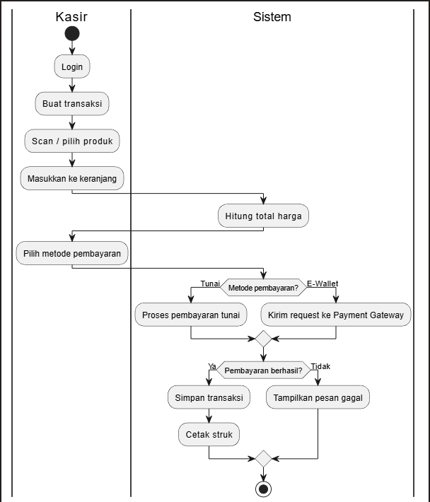
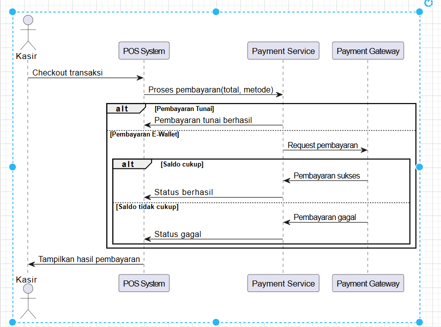
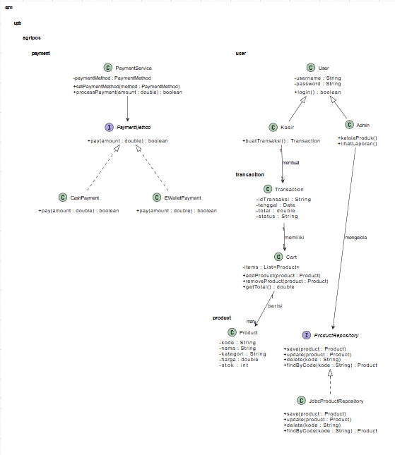

# Laporan Praktikum Minggu 6 
Topik: Desain Arsitektur Sistem dengan UML dan Prinsip SOLID

## Identitas
- Nama  : Egalian Lalintang
- NIM   : 240202833
- Kelas : 3IKRA

---

## Tujuan
Mahasiswa mampu:

Mahasiswa mampu mengidentifikasi kebutuhan sistem ke dalam diagram UML.
Mahasiswa mampu menggambar UML Class Diagram dengan relasi antar class yang tepat.
Mahasiswa mampu menjelaskan prinsip desain OOP (SOLID).
Mahasiswa mampu menerapkan minimal dua prinsip SOLID dalam kode program.
---

## Dasar Teori
Pemodelan sistem dalam pemrograman berorientasi objek diawali dengan penggunaan Unified Modeling Language (UML) Class Diagram, yang berfungsi sebagai cetak biru untuk menggambarkan struktur statis, atribut, metode, serta hubungan antar kelas seperti asosiasi, agregasi, dan pewarisan. Untuk menghasilkan perangkat lunak yang berkualitas, penerapan prinsip SOLID menjadi sangat krusial. Prinsip ini mencakup Single Responsibility Principle yang memastikan setiap kelas hanya memiliki satu tugas, serta Open/Closed Principle yang memungkinkan sistem dikembangkan tanpa harus memodifikasi kode yang sudah ada. Melalui kombinasi UML dan SOLID, pengembang dapat menciptakan arsitektur kode yang tidak hanya terorganisir, tetapi juga fleksibel terhadap perubahan kebutuhan bisnis di masa depan.

---

## Langkah Praktikum
Praktikum dimulai dengan tahap persiapan di mana lingkungan pengembangan Visual Studio Code dikonfigurasi dan struktur folder proyek dibuat sesuai standar Maven di bawah direktori src/main/java/com/pembayaran/. Setelah lingkungan siap, langkah dilanjutkan dengan merancang UML Class Diagram menggunakan alat bantu eksternal untuk memetakan relasi antar antarmuka dan kelas konkret. Pada tahap implementasi kode, dibuat beberapa file utama seperti PaymentMethod.java sebagai interface, serta kelas pendukung seperti CreditBy.java dan EWallet.java yang menerapkan prinsip desain SOLID. Setelah kode selesai ditulis, dilakukan proses kompilasi melalui terminal menggunakan perintah javac dan eksekusi program dengan perintah java untuk memastikan seluruh logika berjalan sesuai harapan. Seluruh progres pekerjaan kemudian didokumentasikan ke dalam sistem kontrol versi Git dengan pesan commit yang deskriptif seperti feat: implement PaymentMethod interface untuk mencatat setiap tahapan perubahan.
---

## Hasil Eksekusi
(Sertakan screenshot hasil eksekusi program.  
 1. 
 2. 
 3. 
 4. 
---

## Analisis
(
Kode program ini berjalan dengan memanfaatkan konsep polimorfisme di mana kelas Main memicu metode pembayaran melalui referensi antarmuka tanpa harus mengetahui detail teknis dari masing-masing metode tersebut. Pendekatan minggu ini memiliki perbedaan yang signifikan dibandingkan minggu sebelumnya, di mana pada pertemuan lalu kode cenderung bersifat kaku (prosedural) dan sering kali menumpuk banyak tanggung jawab dalam satu kelas. Dengan menerapkan SOLID, ketergantungan antar komponen menjadi lebih rendah (loosely coupled) sehingga penambahan fitur baru tidak akan merusak fitur yang sudah stabil. Selama proses praktikum, kendala utama yang dihadapi adalah kesulitan dalam menentukan batas tanggung jawab sebuah kelas agar sesuai dengan prinsip Single Responsibility. Masalah ini akhirnya diatasi dengan melakukan refaktorisasi kode berulang kali dan merujuk kembali pada rancangan UML yang telah dibuat di awal untuk memastikan setiap kelas hanya menangani satu logika spesifik.
)
---

## Kesimpulan
Dapat disimpulkan bahwa penggunaan UML Class Diagram sangat membantu dalam memvisualisasikan alur program sebelum tahap pengodingan dimulai, sehingga meminimalisir kesalahan logika desain. Penerapan prinsip SOLID, terutama Single Responsibility dan Open/Closed, terbukti membuat struktur kode menjadi lebih bersih, mudah dipahami, dan siap untuk dikembangkan dalam skala yang lebih besar tanpa risiko regresi yang tinggi.

---

## Quiz
(1. Bagaimana kode berjalan?
   **Jawaban:** Kode bekerja melalui mekanisme polimorfisme, di mana objek dari kelas konkret (seperti kartu kredit atau e-wallet) diproses melalui sebuah interface umum. Saat program dijalankan, PaymentProcessor memanggil fungsi pembayaran tanpa perlu mengetahui detail teknis setiap metode, sehingga memungkinkan eksekusi logika yang fleksibel dan terpisah antara pengirim perintah dan pelaksana tugas.

2. Apa perbedaan pendekatan minggu ini dibanding minggu sebelumnya?
   **Jawaban:** Perbedaan utama terletak pada penerapan desain arsitektur yang lebih matang menggunakan prinsip SOLID. Dibandingkan minggu lalu yang hanya fokus pada OOP dasar, minggu ini setiap kelas dirancang memiliki satu tanggung jawab spesifik (SRP) dan menggunakan abstraksi (DIP) untuk mengurangi ketergantungan antar-kode. Hal ini membuat sistem lebih mudah dikembangkan tanpa harus merubah kode yang sudah stabil.

3. Kendala yang dihadapi dan cara mengatasinya? 
   **Jawaban:** Kendala yang muncul adalah sulitnya menentukan batasan tanggung jawab antar kelas agar tidak tumpang tindih serta keraguan dalam memilih antara inheritance atau interface. Solusinya dilakukan dengan merancang UML Class Diagram terlebih dahulu sebagai panduan visual dan melakukan refaktorisasi kode secara bertahap untuk memastikan setiap komponen benar-benar mandiri dan sesuai dengan prinsip desain yang diminta.)
